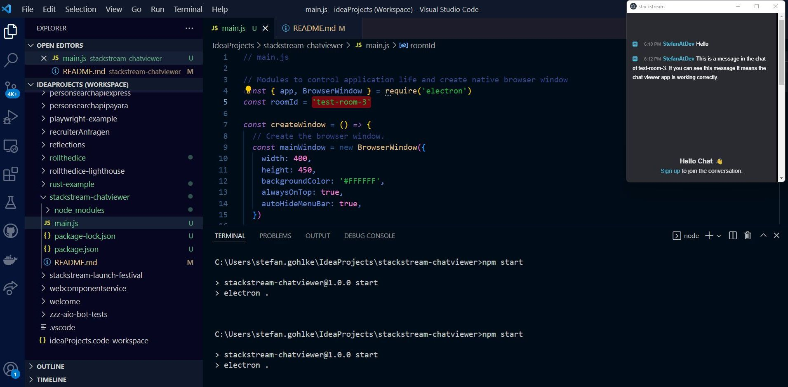
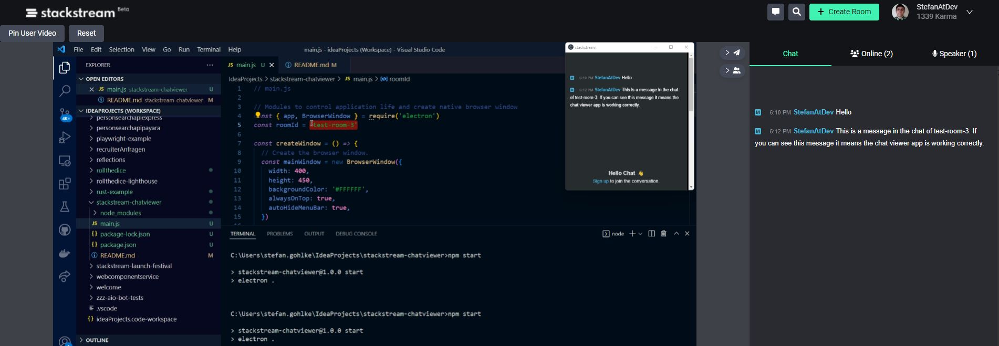

# stackstream Chat Viewer
* You want to create a room on [stackstream](https://stack-stream.com/)?
* You want to keep track of the chat while streaming?
* You want to show the chat on the same window you are showing content on?
* You want to show the chat in the recording?

The strackstream Chat Viewer can help you with these tasks.

## Features
* Display stackstream chat for running livestream.
* Muted audio so it does not interfere with your own audio.
* Window "always on top" so it stays on top of the content you are showing. 

## How to run

### Preparation
1. Checkout this project.
2. Run **npm install** in the root of this project (where package.json is located) to install necessary dependencies.
3. Run the Electron app with **npm start**. You might be asked to allow cookies for stackstream, do that.
4. You can close the app using the close-symbol on the app window.

### Display livestream chat
1. Create and start or join a running room you want to display the chat. You need the room/case-id (the part in the url after https://stack-stream.com/case/)
2. Open **main.js** and change the "roomId" constant to the room you want to display the chat.
3. Run the Electron app with **npm start**. This will open a window showing the chat.
4. If asked allow Electon app to establish outgoing connecection (as it tries to open the website stack-stream.com)
5. You can move around and/or resize the window so it fits your needs

## How it looks like

### What you see on the screen you are sharing

### What is shown in the livestream

